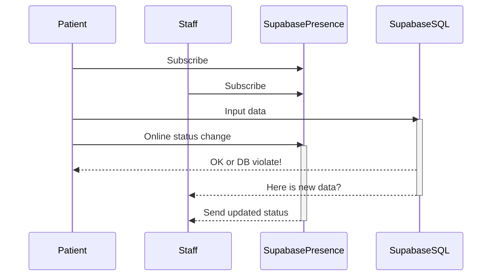

# Next.js and Supabase Realtime input form</h1>


<p align="center">
 Realtime input form with staff viewing system
</p>

<p align="center">
  <a href="#features"><strong>Features</strong></a> ·
  <a href="#demo"><strong>Demo</strong></a> ·
  <a href="#clone-and-run-locally"><strong>Clone and run locally</strong></a> ·
  <a href="#project-structure"><strong>Project Structure</strong></a> ·
  <a href="#design-decision"><strong>Design</strong></a> ·
  <a href="#component-architecture"><strong>Component architect</strong></a> ·
  <a href="#real-time-synchronization-flow"><strong>Real-Time Synchronization flow</strong></a> ·
  <a href="#feedback-and-issues"><strong>Feedback and issues</strong></a>
</p>
<br/>

## Features
- Input form with form validation
  
  
  
  - multiple state for submit button
    
  
  
  
- Multiple Form can be created, edited, and viewed
  - User
    
    
    
  - Staff
    
    
    
- Form is sync realtime when users type in
  
  
  
- Staff can see users online status
  
  

## Demo

You can view a fully working demo at [supabase-realtime-input-form.vercel.app](https://supabase-realtime-input-form.vercel.app/)


## Clone and run locally

1. You'll first need a Supabase project which can be made [via the Supabase dashboard](https://database.new)

2. install dependencies

    ```bash
    npm install
    ```

4. Rename `.env.example` to `.env.local` and update the following:

   ```
   NEXT_PUBLIC_SUPABASE_URL=[INSERT SUPABASE PROJECT URL]
   NEXT_PUBLIC_SUPABASE_ANON_KEY=[INSERT SUPABASE PROJECT API ANON KEY]
   ```

   Both `NEXT_PUBLIC_SUPABASE_URL` and `NEXT_PUBLIC_SUPABASE_ANON_KEY` can be found in [your Supabase project's API settings](https://app.supabase.com/project/_/settings/api)

5. You can now run the Next.js local development server:

   ```bash
   npm run dev
   ```

   The starter kit should now be running on [localhost:3000](http://localhost:3000/).

## Tech Stacks
- [NextJS](https://nextjs.org/) 
  - App Router
  - Client
  - Server
- [Supabase](https://supabase.com/) for Database and Websockets 
- [Tailwind CSS](https://tailwindcss.com) for styling 
- [shadcn/ui](https://ui.shadcn.com/) for basic component 
- [framer-motion](https://motion.dev/) for quick animation setup 


## Project-structure
```
📦 project-root/
 ┣ 📂 app/               # NextJS App Router
 ┃ ┣ 📂 pages/           # Page-level components (Patient, Staff)
 ┃ ┣ 📄 globals.css      # CSS variable setup for Tailwind
 ┃ ┣ 📄 layout/          # Global layout
 ┣ 📂 components/        # Reusable UI components that shared across project
 ┣ 📂 public/            # Static assets (images, favicon, etc.)
 ┣ 📂 type/              # type to share across project
 ┣ 📂 utils/             # utility (mainly used for supabase)
 ┣ 📄 package.json       # Dependencies and scripts
 ┣ 📄 README.md          # Project documentation
 ┗ 📄 .gitignore         # Ignored files for Git
```

## Design Decision
1. use `grid` to managing column of inputs
2. mobile size will be 1 cols
3. desktop will be 2 cols
4. reapply to another layout for consistency

## Component Architecture
Based on Atomic Design

1. **Atoms** - Basic UI elements (button, input, label, pill etc.), will be inside `@/components/ui` directory
2. **Molecules** - Small components groups (Back-button, Label-input-combo, card) will be inside `@/components` directory
3. **Organisms** - Larger UI section that consist multiple Molecules (Patient-Form, Card-list), will be inside each `@/app/[page]` directory, if share across multiple page, will be in `@/components`
4. **Pages** - Fully rendered pages 

## Real-Time Synchronization Flow




   
## Feedback and issues

Please open issues or send feedback to nattawat.arch@gmail.com
